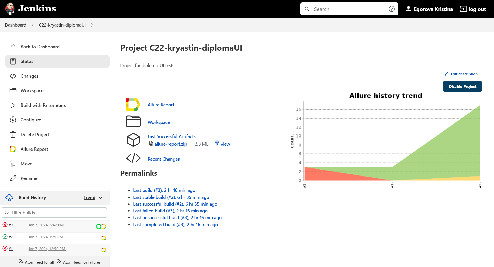
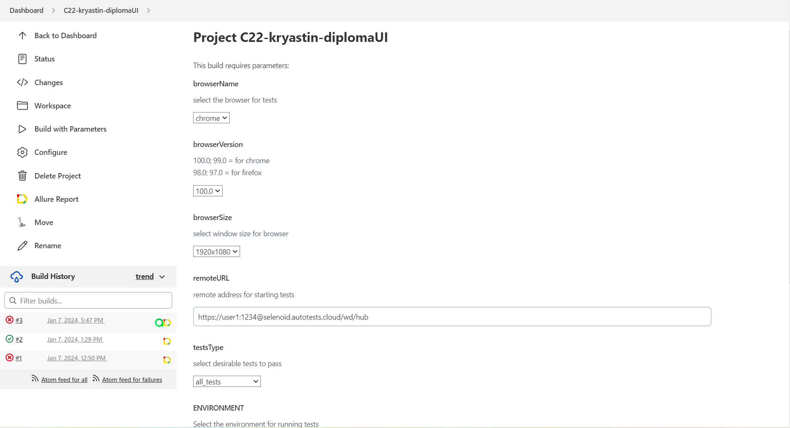
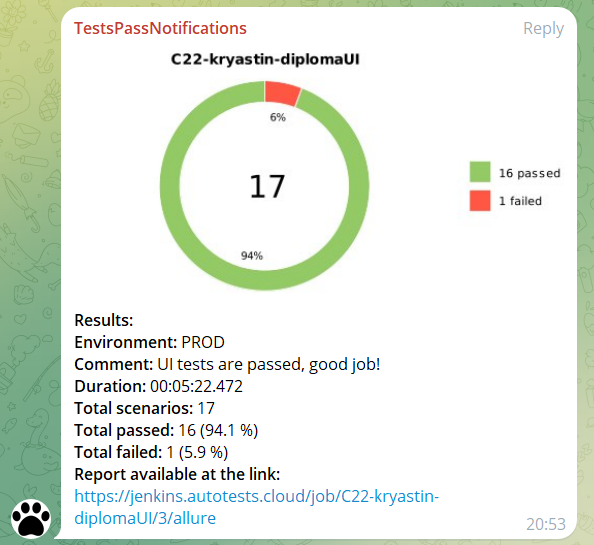
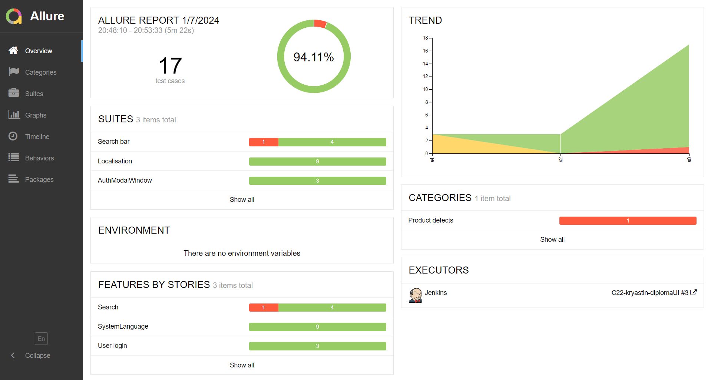
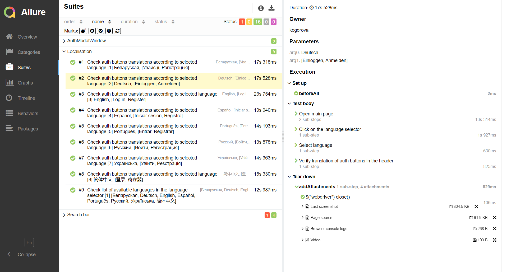
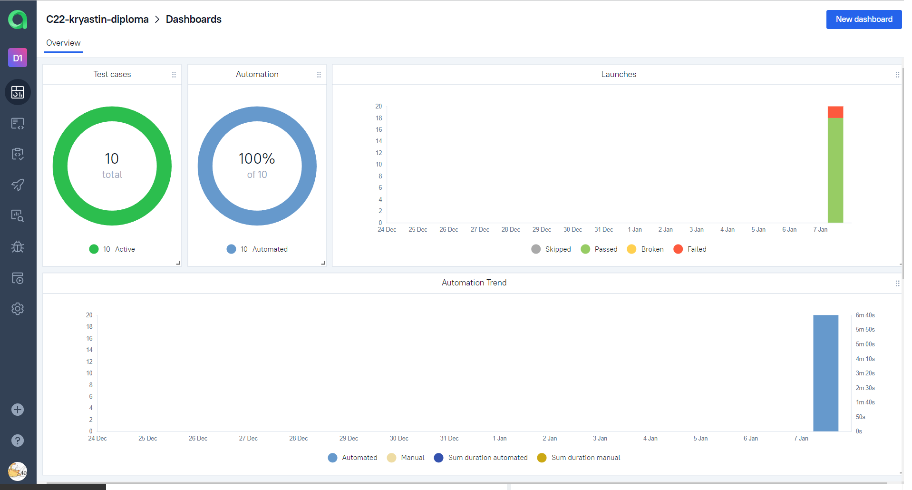
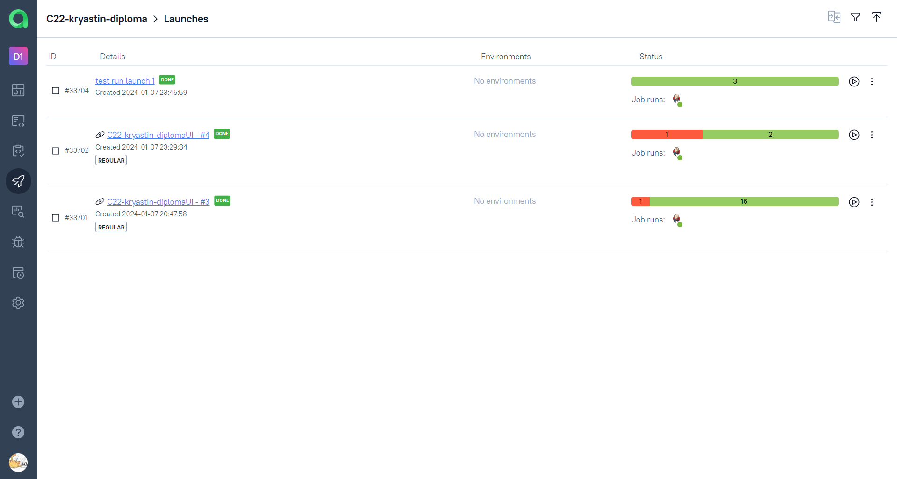
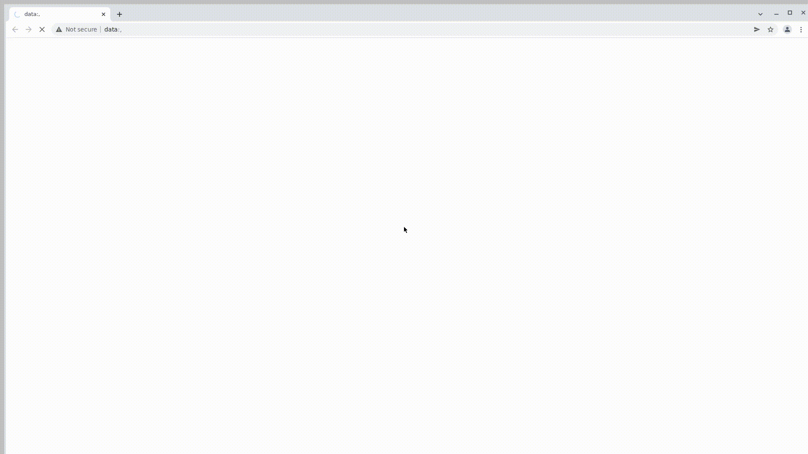

# UI test automation project for [stepik.org](https://stepik.org/catalog)
<center></center>

>Stepik is a cloud-based platform that is designed to create and distribute interactive educational content as well as provide various types of automatically graded assignments with real-time feedback. Platform is suitable for a multitude of e-learning activities, from private on-campus classes to massive open online courses (MOOCs).
## Summary
+ [About the project](#about)
+ [Tools and Technologies](#tools)
+ [How to run](#launch)
    + [Launch tests on your machine locally](#local)
    + [Launch tests on your machine remotely](#remote)
+ [Run in Jenkins](#jenkins)
+ [Telegram Notifications](#telegram)
+ [Report in Allure Report](#allure-report)
+ [Allure TestOps Integration](#allureTO)
+ [Video example of test pass](#video)

<a id="about"></a>
## About the project
The project consists of UI tests. A brief list of interesting facts:
- [x] `Page object` pattern
- [x] Config with `Owner` library
- [x] Different configuration files for test running depending on build parameters
- [x] Parametrized tests
- [x] Autotests as test documentation
- [x] Run tests by `Tags` or all at once
<a id="tools"></a>
## Tools and Technologies
<a href="https://www.java.com/en/"></a>
<a href="https://gradle.org/"></a>
<a href="https://github.com/"></a>
<a href="https://www.jetbrains.com/idea/"></a>
<a href="https://junit.org/junit5/"></a>
<a href="https://selenide.org/"></a>
<a href="https://aerokube.com/selenoid/"></a>
<a href="https://www.jenkins.io/"></a>
<a href="https://github.com/allure-framework/"></a>
<a href="https://qameta.io/"></a>
<a href="https://telegram.org/"></a>

The project is written in `Java` using `Selenide` framework.  
- `Gradle` - is used as a build automation tool.  
- `JUnit5` - to execute tests.
- `Jenkins` - is CI/CD for running tests remotely.  
- `Selenoid` - to remote launching browsers in Docker containers.  
- `Allure Report` - for test results visualisation.  
- `Telegram Bot` - for test results notifications.  
- `Allure TestOps` - as Test Management System.
<a id="launch"></a>
## How to run
<a id="local"></a>
### Launch tests on your machine locally
> [!IMPORTANT]
> Be sure you have installed Java, Gradle, Inteliji Idea and have had Chrome as browser
>
Tests are divided by different features, it is possible to run not only all tests but also by feature tags.  
Available feature test runs are:
- auth_modal_tests
- localisation_tests
- search_tests

Use the following command to run all tests:  
```gradle clean test```  
or  
```gradle clean test -Denv=local```  
<a id="remote"></a>
### Launch tests on your machine remotely
Command with additional parameter `-Denv` should be used to run tests remotely :  
```gradle clean test -Denv=remote```  

All browser configurations are described in the `local.properties` and `remote.properties` files.  
If needed configurations could be changed in those files.  
Properties file config explanation:
>browserName - browser for Web tests, chrome and firefox supported  
>browserVersion - version of browser for Web tests  
>browserSize - size of browser for Web tests  
>baseUrl - base URL for Web tests  
>isRemote - defines local or remote environments  
>remoteURL - URL for remote WebDriver  

<a id="jenkins"></a>
## Run in [Jenkins](https://jenkins.autotests.cloud/job/C22-kryastin-diplomaUI/)

Build with parameters allows to customize your test run: different browsers, window resolutions, etc.  


After the build is done the test results are available in `Allure-report` and `Allure TestOps`
<a id="telegram"></a>
## Telegram Notifications
Telegram bot sends a brief report to a specified telegram chat by results of each build.

<a id="allure-report"></a>
## Report in Allure Report
Main page with common information  

List of tests with steps and test artefacts  

<a id="allureTO"></a>
## Allure [TestOps Integration](https://allure.autotests.cloud/project/3925/dashboards)
>Test-cases in the project are imported and constantly updated from the code, so there is no need in complex process of synchronization manual test-cases and autotests.  
>It is enough to create and update an autotest in the code and the test-case in TMS always will be in actual state.  
>Manual test-cases also can be added in TMS in case of need (via web interface or via code).
### Dashboard preview  
  

### Test cases  
  

### Test runs  
  

<a id="video"></a>
## Video example of test pass
<p>
  
</p>
